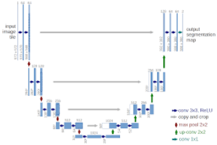
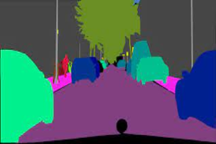

<h1><center> CDS_UTE_2023 <br> SELF DRIVING CAR</center></h1>

## Introduction
The 2nd contest "Self-Driving Car using Image Processing and Artificial Intelligence" in 2022 by UTE organizated

Contest format: Program the car on the simulation software and let the car pass the checkpoints.

## Timeline: 

    30/12/2022: Vòng loại
    14/02/2023: Vòng chung kết

## SPK Sandbox Team
Mentor: [Đỗ Trần Nhật Tường](https://github.com/dotrannhattuong)

Leader: [Trần Văn Hồ ](https://github.com/tranvanhospk)

- [Nguyễn Hoàng Anh Tuấn](https://github.com/aTunass) 

- [Nguyễn Ngọc Lê](https://github.com/lenguyen45911)

- [Nguyễn Hương Quỳnh](https://github.com/nguyenhuongquynh2607)

- [Trần Hữu Hiếu](https://github.com/HieuTran2019)
 

## To do task 
- [x] Labels 
- [x] [Vòng sơ loại](https://github.com/dotrannhattuong/CDS_UTE_2023/blob/main/client_vong_loai.py)
- [ ] [Vòng chung kết](https://github.com/dotrannhattuong/CDS_UTE_2023/blob/main/UTE_client_chungket.py)
---
## Speed
```
- Vòng sơ loại:
    Tốc độ tối đa: 65

```
```
- Vòng chung kết UTE:
    Tốc độ tối đa: 72
    Tốc độ khi gặp biển báo: 69
    Tốc độ khi gặp vật cản: 70
    Model: YoloV7, UNET
```
## Setup
```
# CUDA 10.2
conda install pytorch==1.10.1 torchvision==0.11.2 torchaudio==0.10.1 cudatoolkit=10.2 -c pytorch
# CUDA 11.3
conda install pytorch==1.10.1 torchvision==0.11.2 torchaudio==0.10.1 cudatoolkit=11.3 -c pytorch -c conda-forge
```
```
pip install -r requirements.txt
```

---
## Download requirement files
- [Unet](https://drive.google.com/file/d/1G91QEeZAHvvWGLhc3EIihxguBDojcn3d/view?usp=sharing)



- [YoloV7](https://drive.google.com/file/d/1o1CSS_BuofBFidCzMbMRg5CLdZ7Hwdmh/view?usp=sharing)
- [YoloV7E6]()
- [YoloV8](https://drive.google.com/file/d/1K9DMjMO-n7P60l2gSdoe9Ecvxxs8zhzT/view?usp=sharing)

## MAP 2023
- [Map vòng loại](https://drive.google.com/drive/folders/1Ml0AbdFrBeP5l68zCzwIkUqS3WqkgGl7?usp=sharing)
- [Map vòng chung kết (demo)](https://drive.google.com/drive/folders/1ZcfpKk4Pw33Z3NCO2BVZk4efuu-Phrbd?usp=sharing)
## Training


## Inference
```
python client.py
```

## Build and run docker


## Report
