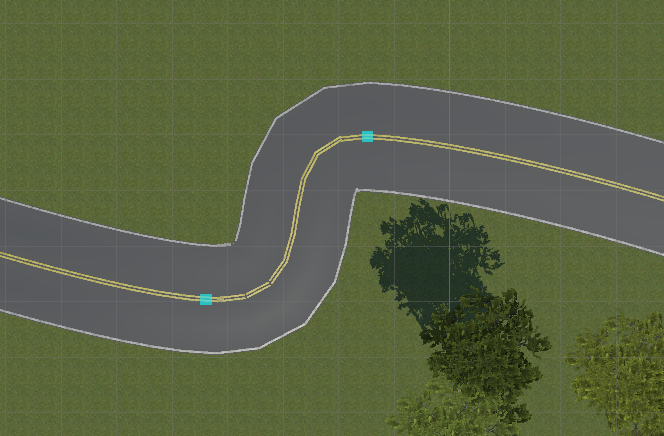

<h1><center> CDS_UTE_2023 <br> SELF DRIVING CAR</center></h1>

## Introduction
The 2nd contest "Self-Driving Car using Image Processing and Artificial Intelligence" in 2022 by UTE organizated

Contest format: Program the car on the simulation software and let the car pass the checkpoints.

## Timeline: 

    30/12/2022: Vòng loại
    14/02/2023: Vòng chung kết

## SPK Sandbox Team
Mentor: [Đỗ Trần Nhật Tường](https://github.com/dotrannhattuong)

Leader: [Trần Văn Hồ ](https://github.com/tranvanhospk)

- [Nguyễn Hoàng Anh Tuấn](https://github.com/aTunass) 

- [Nguyễn Ngọc Lê](https://github.com/lenguyen45911)

- [Nguyễn Hương Quỳnh](https://github.com/nguyenhuongquynh2607)

- [Trần Hữu Hiếu](https://github.com/HieuTran2019)
 

## To do task 
- [x] Labels 
- [x] [Vòng sơ loại](https://github.com/dotrannhattuong/CDS_UTE_2023/blob/main/client_vong_loai.py)
- [x] [Vòng chung kết](https://github.com/dotrannhattuong/CDS_UTE_2023/blob/main/UTE_client_chungket.py)
---
## Speed


---
```
- Vòng sơ loại:
    + Tốc độ tối đa: 65
    + Code: 2 khúc cua gấp liền nhau -> Dùng timer khi cua gấp để tránh cua sớm ở khúc cua kế 
```
- [Kết quả vòng sơ loại](https://www.youtube.com/watch?v=r5NXqryFd5U)
```
- Vòng chung kết UTE:
    + Tốc độ tối đa: 75
    + Tốc độ khi gặp biển báo: 71.5
    + Tốc độ khi gặp vật cản: 75
    + Model: YoloV8, UNET
    + Code: 
       Khúc cua: Timer với thời gian delay phục thuộc vào tốc độ để đi thẳng -> Cua góc 25 với timer 1.1s
       Đi thẳng: Timer với góc lái bằng 0
       Thời điểm cua: Max > 152 or Min < 8
       Điều khiển tốc độ: Dùng hàm Linear
       Lên dốc: Hạ line, góc bù thêm 1
       Cua gấp, xuống dốc: Tốc độ lớn hơn 62, angle>11 -> angle=25
```
- [Kết quả vòng chung kết (demo)](https://www.youtube.com/watch?v=bjkq4dZFzao)
## Setup
```
# CUDA 10.2
conda install pytorch==1.10.1 torchvision==0.11.2 torchaudio==0.10.1 cudatoolkit=10.2 -c pytorch
# CUDA 11.3
conda install pytorch==1.10.1 torchvision==0.11.2 torchaudio==0.10.1 cudatoolkit=11.3 -c pytorch -c conda-forge
```
```
pip install -r requirements.txt
```

---
## Download requirement files
- [Unet](https://drive.google.com/file/d/1b6Ew_R8gJywSL6chGk_4I9lFL7yrdZsH/view?usp=sharing)


- [YoloV7](https://drive.google.com/file/d/1ZfsixmYRqYa9qYFaKERfqGS5y8rE8K4S/view?usp=sharing)
- [YoloV7E6]()
- [YoloV8](https://drive.google.com/file/d/1GbMtBivUqZnhPquq-a36-9WMytVIVgM-/view?usp=sharing)

## MAP 2023
- [Map vòng loại](https://drive.google.com/drive/folders/1Ml0AbdFrBeP5l68zCzwIkUqS3WqkgGl7?usp=sharing)
- [Map vòng chung kết (demo)](https://drive.google.com/drive/folders/1ZcfpKk4Pw33Z3NCO2BVZk4efuu-Phrbd?usp=sharing)
## Training


## Inference
```
python client.py
```
## Reference 
- Object Detection: https://github.com/dotrannhattuong/CDS_UTE_2023/blob/main/docs/Object%20Detection.pptx.pdf
- Code: https://github.com/dotrannhattuong/CDS_UTE_2023/blob/main/docs/UIT-CAR-RACING-2021.pdf
## Survey


## Build and run docker

## Report
- [Final Round](https://github.com/dotrannhattuong/CDS_UTE_2023/blob/main/docs/Cu%E1%BB%99c-thi-%C4%91ua-xe-t%E1%BB%B1-h%C3%A0nh.pptx)
